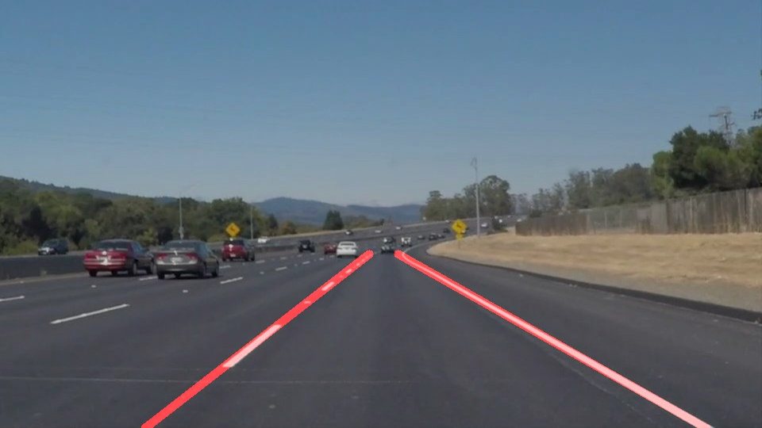
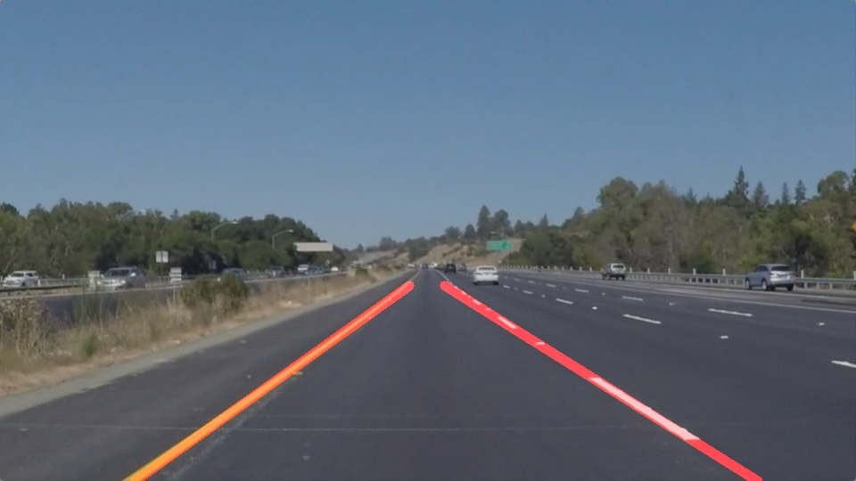
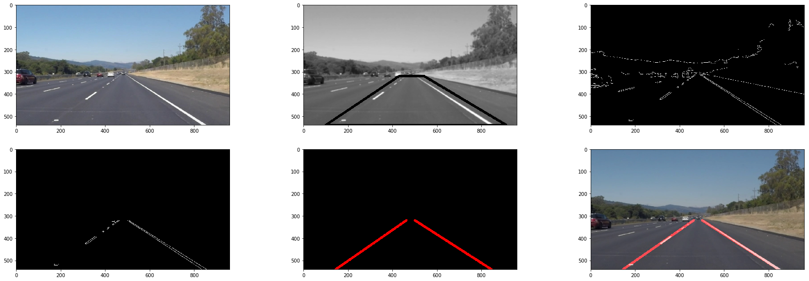

# **Finding Lane Lines on the Road** 

## Goals

The goals / steps of this project are the following:

* Make a pipeline that finds lane lines on the road
* Reflect on your work in a written report

## Overview

This projects provides an image processing pipeline to identify and mark lane lines on road images/video, under specific conditions.

Below you can find sample input and output images.

  
   

## Reflection

### 1. The Pipeline

For any input image, the pipeline (see `pipeline` function) consists of 6 steps:
1. Conversion to grayscale.
2. Blur image
3. Canny edge detection
4. Apply mask to only keep pixels on road area.
5. Identify lines in the mask.
6. Draw found lines into the original image.

Each step can be seen on the figure below. 

#### Dealing with multiple hough lines

Considering the gradient (Canny) is used to find borders on images, each lane line (reactangles) will produce **at least** 2 lines (with similar slope), for left and right margins. Then, if the two lane lines were solid, then we expect to find 4 lines in hough.

Also, if the line is not solid, then the lane line will be composed by multiple lane markings of similar slope.

The strategy applied to consolidate multiple lines into just left and right, depends on both lines connecting on the horizon, placed near the middle of the road.
So, all lines with negative slope are merged into a *right* line, and lines with positive slope are merged into *left* lines.

This strategy is not applied to the `draw_lines` functions, but to the output of the OpenCV `HoughLinesP`. Please, see the modified `hough_lines()` function and the provided `extract_lr_lines()` function.

#### Dealing with vibration on image sequences

When applying this pipeline to a video, the output lines will appear to be vibrating a lot, due to an imperfect pipeline and the camera vibration.

In order to reduce this effect and to provide more consistent lane markings on the video, a moving average is applied to the slope and offset of the computed lines. The slope/offset used for each line is computed as the average of the last N computations. See more on the `merge_lines()` function.

### 2. Identified Shortcomings

This pipeline was designed to work under very specific circumstances. For instance, the following assumptions are identified:

- Camera is pointing directly to the road.
- Car capo is not on the image.
- Daylight/Shadow contitions as in the sample images.
- There is no car directly in front.
- Lines are not occluded.
- There is always 2 lane lines.
- There are no road symbols/words written on the road.
- Lane Lines are way more brighter than the road on the grayscale image.
- Lane Lines merge in the horizon, placed to the center of the road.
- Mask has to be provided as an input to the pipeline.

### 3. Possible Improvements

- Image can be separated into left/right section, to avoid merging left/right lines.
- An interior mask can be applied, in order to remove unexpected pixels on the hough lines computation, as cars, symbols, and shadows.
- Brightness problems can be reduced by applying the histogram equalization technique. Also, another color model as HSL can be used to deal with brightness.

